# 🌙 Aggarly — Dark-Sky Sanctuary Rental & Autonomous Concierge Platform

<p align="center">
  
  
  
  
  
  
  
  
</p>

---

## 📖 Table of Contents

- [Overview](#-overview)
- [System Architecture](#-system-architecture)
- [Module Directory](#-module-directory)
- [Core Features & Capabilities](#-core-features--capabilities)
  - [1. Multi-Agent Autonomous AI Concierge](#1-multi-agent-autonomous-ai-concierge)
  - [2. Multimodal Visual & Vector Search Engine](#2-multimodal-visual--vector-search-engine)
  - [3. Astronomical Ephemeris & Dynamic Lumen Yield](#3-astronomical-ephemeris--dynamic-lumen-yield)
  - [4. Host Operations & Financial Settlement Suite](#4-host-operations--financial-settlement-suite)
  - [5. Guest Journeys, Shared Wishlists & Arrival Dossier](#5-guest-journeys-shared-wishlists--arrival-dossier)
  - [6. Autonomous Cron Scheduler & Telemetry](#6-autonomous-cron-scheduler--telemetry)
  - [7. Nocturnal Support & Price Watchdog Radar](#7-nocturnal-support--price-watchdog-radar)
  - [8. Real-time Notifications & WebSocket Messaging](#8-real-time-notifications--websocket-messaging)
- [Security & Architectural Guardrails](#-security--architectural-guardrails)
- [REST API Reference](#-rest-api-reference)
- [Getting Started](#-getting-started)
  - [Prerequisites](#prerequisites)
  - [Infrastructure Setup via Docker](#infrastructure-setup-via-docker)
  - [Environment Configuration](#environment-configuration)
  - [Build and Launch](#build-and-launch)
- [Testing & Quality Assurance](#-testing--quality-assurance)
- [License](#-license)

---

## 🌟 Overview

**Aggarly** is an enterprise-grade modular backend platform purpose-built for luxury dark-sky celestial sanctuaries, astronomical observatories, and secluded architectural retreats.

Operating at the intersection of hospitality, astrophotography, and autonomous AI systems, Aggarly delivers:
- **Intelligent Autonomous Concierge**: An 8-agent swarm orchestrating complex guest stays, bookings, astronomical forecasts, and host management.
- **Multimodal Perception**: 3-channel vector search combining neural visual embeddings, auto-generated semantic captions, and sanctuary descriptions.
- **Astronomical Precision**: Real-time synodic moon phase illumination calculations, Bortle dark-sky classification enforcement, and acoustic decibel verification.
- **Operational Excellence**: Turnkey escrow disbursement, VAT-compliant invoicing, RFC-5545 calendar sync, and 24/7 nocturnal emergency dispatch.

---

## 🏗️ System Architecture

```mermaid
flowchart TD
    subgraph Clients["Frontend Clients & Protocols"]
        Web["Next.js / React Web App"]
        Mobile["Mobile App"]
        SSE_Client["SSE Telemetry Stream"]
        WS_Client["STOMP WebSocket Client"]
    end

    subgraph Security["Edge Security & Auth"]
        SecurityConfig["Spring Security 6 (Stateless JWT)"]
        JwtFilter["JwtAuthenticationFilter"]
        OAuth2["OAuth2 (Google / GitHub)"]
        MFA["TOTP MFA / OTP Engine"]
    end

    subgraph Controllers["Spring Boot REST & WebSocket Controllers"]
        PropCtrl["Property & Multi-Calendar API"]
        BookCtrl["Booking, Dossier & iCal API"]
        HostCtrl["Host Financials & Turnover API"]
        AICtrl["AI Concierge & Audit API"]
        VisCtrl["Vision & Vector Search API"]
        SchedCtrl["Cron Scheduler API"]
        WatchCtrl["Watchdog & Telemetry API"]
        HelpCtrl["Nocturnal Support Desk API"]
    end

    subgraph Services["Core Domain & Agent Services"]
        AgentEngine["8-Agent Autonomous Swarm"]
        Ephemeris["Celestial Synodic Calculator"]
        VectorMesh["Qdrant Multimodal Fusion"]
        PricingEngine["Dynamic & Lumen Yield Engine"]
        PaymentEngine["Stripe Escrow & Payout Gateway"]
    end

    subgraph Storage["Data & Vector Infrastructure"]
        Postgres[(PostgreSQL 16\nFlyway V1–V42)]
        Redis[(Redis 7\nCache & Sessions)]
        Qdrant[(Qdrant Vector DB\n768d Multi-Vectors)]
        MinIO[(MinIO / S3\nEncrypted Media)]
    end

    Clients --> Security
    Security --> Controllers
    Controllers --> Services
    Services --> Storage
```



---

## 📦 Module Directory

The codebase is organized into clean, high-cohesion domain modules under `com.luna.aggarly`:

| Module | Package | Description |
|---|---|---|
| **AI Agent** | `com.luna.aggarly.aiagent` | 8-agent autonomous concierge, memory context, planning engine, tool injection, SSE audit |
| **Availability** | `com.luna.aggarly.availability` | Real-time sanctuary calendar grids, multi-property date queries, date locking |
| **Booking** | `com.luna.aggarly.booking` | Reservation lifecycles, expiration job, RFC-5545 `.ics` export, VAT receipt, arrival credentials |
| **Chat** | `com.luna.aggarly.chat` | STOMP WebSocket chat rooms, 1-on-1 resident drawers, read receipts, AI bridge |
| **Cleaning** | `com.luna.aggarly.cleaning` | Turnover dispatches, inspection checklists, acoustic decibel readings, silence certification |
| **Common** | `com.luna.aggarly.common` | Central security config, JWT handling, correlation IDs, standardized `ApiResponse<T>`, base entities |
| **File Storage** | `com.luna.aggarly.filestorage` | MinIO / AWS S3 media management, secure presigned upload/download URLs |
| **Help Desk** | `com.luna.aggarly.help` | Dark-sky covenants knowledge base, emergency nocturnal signals, instant support dispatches |
| **Host** | `com.luna.aggarly.host` | Host financials hub, itemized settlement ledger, tax certificates (Modelo 036), turnovers |
| **Notification** | `com.luna.aggarly.notification` | Multi-channel notifications, SSE live stream `/stream`, email dispatches, preference management |
| **Payment** | `com.luna.aggarly.payment` | Stripe gateway integration, escrow capture, webhook handlers, radar fraud risk analysis |
| **Pricing** | `com.luna.aggarly.pricing` | Dynamic pricing rules, seasonal discounts, promotional coupons, automatic lumen yields |
| **Property** | `com.luna.aggarly.property` | Sanctuary catalog, Bortle rating (Class 1–9), acoustic ambient dB, astrophotography scores |
| **Review** | `com.luna.aggarly.review` | Guest reviews, quietude & optics ratings, public curatorial replies by sanctuary hosts |
| **Scheduler** | `com.luna.aggarly.scheduler` | Autonomous background cron scheduler, one-shot agent execution, cluster metrics |
| **User** | `com.luna.aggarly.user` | Authentication, RBAC, session governance, OAuth2, TOTP MFA, phone & email validation |
| **Vision** | `com.luna.aggarly.vision` | CLIP embeddings, Qdrant vector retrieval, image perception, quality scoring, room clustering |
| **Watchdog** | `com.luna.aggarly.watchdog` | Autonomous price drop and availability radar with periodic 15-minute background evaluation |

---

## 🚀 Core Features & Capabilities

### 1. Multi-Agent Autonomous AI Concierge
- **8 Specialized Swarm Agents**:
  - `PropertyAgent`: Sanctuary discovery, Bortle dark-sky filtering, acoustic level matching.
  - `BookingAgent`: Reservation workflows, calendar locks, cancellation quotes, policy resolution.
  - `TravelAgent`: Celestial observation itineraries, stargazing schedules, planetary alignment advice.
  - `HostAgent`: Host operations, review replies, availability blocking, yield management.
  - `SupportAgent`: Nocturnal assistance, lockbox emergency bypass, IDA covenant policies.
  - `AdminAgent`: System telemetry, vector index management, user identity governance.
  - `SchedulingAgent`: Background cron scheduling and recurring autonomous task execution.
  - `VisionAgent`: Multimodal search, visual style similarity, aesthetic quality grading.
- **Dynamic Tool Registry**: Every tool implements `Tool<?, ?>` and is dynamically registered with the LLM at runtime with complete JSON schemas.
- **Fallback AI Concierge Thread**: Any chat message referencing `conversationId == 00000000-0000-0000-0000-000000000000` (or `null`) automatically creates or attaches to the user's active AI Concierge thread.
- **Live SSE Audit Stream**: Real-time tool execution logs streamed over `GET /api/v1/ai/audit/stream`.

### 2. Multimodal Visual & Vector Search Engine
- **3-Channel Vector Retrieval**:
  - `image_vector` (768d): Dense image embedding from OpenCLIP.
  - `caption_vector` (768d): Semantic text embedding of AI-generated image captions.
  - `description_vector` (768d): Sanctuary listing and contextual metadata embedding.
- **Dynamic Fusion Weights**: Adapts automatically based on query modality (text-only, image-only, or multimodal).
- **Two-Stage Reranking**: Ultra-fast ML cross-encoder reranking followed by optional LLM aesthetic judge.
- **Visual Intelligence Pipeline**: Automated perceptual hash (pHash) deduplication, blur/overexposure detection, room classification (`BEDROOM`, `OBSERVATORY`, `PATIO`), and cover photo selection.

### 3. Astronomical Ephemeris & Dynamic Lumen Yield
- **Astronomical Synodic Formula**: Computes precise lunar illumination percentage (`0.0%` New Moon to `100.0%` Full Moon) based on Julian reference epochs for any sanctuary date range.
- **Dynamic Lumen Yield**: Automated pricing modifier increasing nightly rates by `+18%` during optimal celestial observation windows (apogee / waxing gibbous).
- **Dark-Sky Covenants**: Property listings enforce International Dark-Sky Association (IDA) Bortle ratings (Class 1–3) and acoustic limits (<24 dBA).

### 4. Host Operations & Financial Settlement Suite
- **Financials Hub (`/api/v1/host/financials`)**:
  - Key Performance Metrics: Gross booking volume (GMV), net host earnings, pending escrow horizon, disbursed YTD, platform take-rate (12%), next scheduled payout date and amount.
  - Itemized Settlement Ledger: Per-stay escrow clearance status, payout breakdown, and platform commissions.
  - Official Tax Documentation: Modelo 036 and itemized VAT summaries.
- **Master Reservations Hub**: Real-time filtering by residency status (`IN_HOUSE`, `UPCOMING`, `COMPLETED`, `CANCELLED`).
- **Turnover & Acoustic Silence Certification**:
  - Dispatch cleaning, maintenance, and acoustic inspection crews (`/api/v1/host/turnover/dispatch`).
  - Log sound readings in decibels (dBA) and certify silence standards before guest arrival.

### 5. Guest Journeys, Shared Wishlists & Arrival Dossier
- **Private Shared Boards**: Generate unguessable private tokens (`POST /api/v1/wishlists/{id}/share`) to share curated sanctuary collections with companions.
- **Arrival Dossier (`/api/v1/bookings/{id}/dossier`)**:
  - Keyless Vault PIN (e.g., `8829-41#`) activated at 16:00 CEST check-in window.
  - Sanctuary Fiber Wi-Fi SSID and passkey.
  - GPS coordinates and low-beam headlight protocol for dark-sky preserves.
  - Pre-arrival telescope calibration and collimation status.
- **RFC-5545 iCalendar (`.ics`)**: Direct `.ics` export for Apple Calendar, Google Calendar, and Outlook.
- **VAT Receipts & Invoices**: Official PDF/JSON invoices with subtotal, 10% hospitality VAT, tourist tax, and Stripe escrow references.

### 6. Autonomous Cron Scheduler & Telemetry
- **Scheduler Engine (`/api/v1/scheduled-tasks`)**:
  - Create and manage recurring cron expressions or one-shot agent tasks.
  - Pause, resume, and trigger immediate ad-hoc executions (`/run-now`).
  - Access execution run history, logs, step outputs, and correlation IDs.
- **Cluster Telemetry**: Real-time monitoring of cluster health (`HEALTHY` / `DEGRADED`), active cron jobs, 7-day success rate, and worker pool concurrency.

### 7. Nocturnal Support & Price Watchdog Radar
- **Nocturnal Knowledge Base (`/api/v1/help/articles`)**: Full-text search across Bortle covenants, optical etiquette, vault lockbox protocols, and telescope collimation guides.
- **Emergency Nocturnal Signals (`POST /api/v1/help/signals`)**: High-priority incident reporting for lockout emergencies or equipment failures with immediate notifications to on-call curators.
- **Price & Availability Watchdogs (`/api/v1/watchdogs`)**:
  - Register radar monitors with target nightly ceilings, target dates, and Bortle thresholds.
  - Automated Spring Boot `@Scheduled` worker evaluating price drops and date changes every 15 minutes.

### 8. Real-time Notifications & WebSocket Messaging
- **Server-Sent Events (SSE)**: Live streaming dispatch channel (`/api/v1/notifications/stream`) for instant keycode issuance and celestial triggers without polling.
- **STOMP WebSocket**: Bidirectional messaging at `/ws` and `/ws/chat` for resident-to-host conversations.
- **Multi-Channel Delivery**: In-app notifications, email notifications (via Mailhog in dev / SMTP in prod), and SMS alerts.

---

## 🔒 Security & Architectural Guardrails

The project strictly follows core architectural and security rules:

1. **Central Security Boundary**:
   - Authentication is centrally managed in [`SecurityConfig.java`](file:///E:/java%20project/aggarly/src/main/java/com/luna/aggarly/common/security/SecurityConfig.java) with `.anyRequest().authenticated()`.
   - Explicit `permitAll()` is restricted to public discovery, shared wishlists, help articles, calendar exports, Swagger UI, and WebSocket handshakes (`/ws/**`, `/ws/chat/**`).
2. **No `@PreAuthorize("isAuthenticated()")`**:
   - Controller methods never use `@PreAuthorize("isAuthenticated()")`. Only role checks (e.g., `@PreAuthorize("hasRole('ADMIN')")`, `@PreAuthorize("hasRole('HOST')")`) are used.
3. **Database Integrity & Cascades**:
   - `CascadeType.ALL` is avoided on parent `@OneToMany` collections when child entities are persisted through dedicated repositories to prevent composite key constraint violations.
   - All auditing entities inherit from [`BaseEntity.java`](file:///E:/java%20project/aggarly/src/main/java/com/luna/aggarly/common/entity/BaseEntity.java) (`created_at`, `updated_at`, `created_by`, `updated_by`, `is_deleted`).
4. **Zero Mock Data**:
   - All telemetry, financial numbers, lunar illumination ratios, and task metrics are derived from live database entities or verified mathematical algorithms.

---

## 🌐 REST API Reference

The platform provides a comprehensive suite of REST APIs. Key endpoints include:

<details>
<summary><b>Promotions & Cron Scheduler APIs</b></summary>

| Method | Endpoint | Description | Access |
|---|---|---|---|
| `GET` | `/api/v1/coupons` | List promotional coupons (filterable by `tier`, `seasonal`) | ADMIN |
| `POST` | `/api/v1/coupons` | Create new promotional discount coupon | ADMIN |
| `GET` | `/api/v1/coupons/metrics` | Campaign performance metrics | ADMIN |
| `POST` | `/api/v1/coupons/validate` | Validate coupon code and compute discount amount | Public |
| `POST` | `/api/v1/coupons/{id}/deactivate` | Deactivate active coupon | ADMIN |
| `GET` | `/api/v1/scheduled-tasks` | List scheduled background tasks | Authenticated |
| `POST` | `/api/v1/scheduled-tasks` | Create recurring cron or one-shot task | Authenticated |
| `POST` | `/api/v1/scheduled-tasks/{id}/run-now` | Trigger immediate ad-hoc task execution | Authenticated |
| `POST` | `/api/v1/scheduled-tasks/{id}/pause` | Pause active task | Authenticated |
| `POST` | `/api/v1/scheduled-tasks/{id}/resume` | Resume paused task | Authenticated |
| `GET` | `/api/v1/scheduled-tasks/{id}/executions` | Get task execution run history | Authenticated |
| `GET` | `/api/v1/scheduled-tasks/metrics` | Scheduler cluster health & concurrency | Authenticated |

</details>

<details>
<summary><b>Guest Trips, Wishlists & Booking APIs</b></summary>

| Method | Endpoint | Description | Access |
|---|---|---|---|
| `GET` | `/api/v1/bookings/me` | Current guest bookings (filter: `?status=UPCOMING\|PAST\|CANCELLED`) | Authenticated |
| `GET` | `/api/v1/bookings/{id}/calendar.ics` | Export RFC-5545 iCalendar file | Public / Guest |
| `GET` | `/api/v1/bookings/{id}/invoice` | Itemized VAT invoice & escrow receipt | Authenticated |
| `GET` | `/api/v1/bookings/{id}/dossier` | Secure arrival dossier, vault PIN, Wi-Fi credentials | Authenticated |
| `POST` | `/api/v1/bookings/{id}/message` | Direct messaging drawer between resident and host | Authenticated |
| `GET` | `/api/v1/wishlists` | List guest wishlists | Authenticated |
| `POST` | `/api/v1/wishlists` | Create new wishlist | Authenticated |
| `POST` | `/api/v1/wishlists/{id}/share` | Generate unguessable shared-board link token | Authenticated |
| `GET` | `/api/v1/wishlists/shared/{token}` | View shared wishlist collection | Public |
| `PUT` | `/api/v1/wishlists/{id}/rename` | Rename collection title and description | Authenticated |
| `POST` | `/api/v1/wishlists/{id}/items` | Add sanctuary to wishlist collection | Authenticated |
| `DELETE` | `/api/v1/wishlists/{id}/items/{propertyId}` | Remove sanctuary from wishlist | Authenticated |

</details>

<details>
<summary><b>Host Operations & Financials APIs</b></summary>

| Method | Endpoint | Description | Access |
|---|---|---|---|
| `GET` | `/api/v1/host/financials/summary` | Host financial summary (GMV, net earnings, pending escrow) | HOST |
| `GET` | `/api/v1/host/financials/ledger` | Itemized booking settlements & escrow clearance | HOST |
| `GET` | `/api/v1/host/financials/tax-statements` | Tax certificates and deduction summaries | HOST |
| `GET` | `/api/v1/bookings/host` | Host reservations (filter: `IN_HOUSE\|UPCOMING\|COMPLETED\|CANCELLED`) | HOST |
| `GET` | `/api/v1/properties/multi-calendar` | Batch sanctuary date grids & moon illumination % | Public |
| `POST` | `/api/v1/pricing/lumen-yield-toggle` | Global celestial dynamic yield pricing toggle (+18%) | HOST |
| `GET` | `/api/v1/reviews/host` | Aggregated guest reviews across all host sanctuaries | HOST |
| `POST` | `/api/v1/reviews/{id}/response` | Post public curatorial reply to a guest review | HOST / ADMIN |
| `GET` | `/api/v1/host/turnover/tasks` | Aggregated turnover tasks across host properties | HOST |
| `POST` | `/api/v1/host/turnover/dispatch` | Dispatch turnover or acoustic silence inspection | HOST |
| `PATCH` | `/api/v1/host/turnover/tasks/{id}/status` | Update task inspection status & decibel reading | HOST |

</details>

<details>
<summary><b>Utilities, Help Desk & Price Watchdog APIs</b></summary>

| Method | Endpoint | Description | Access |
|---|---|---|---|
| `GET` | `/api/v1/notifications` | List user notifications (filter: `category`) | Authenticated |
| `POST` | `/api/v1/notifications/{id}/read` | Mark notification as read | Authenticated |
| `POST` | `/api/v1/notifications/read-all` | Mark all unread notifications as read | Authenticated |
| `GET` | `/api/v1/notifications/stream` | Real-time Server-Sent Events (SSE) stream | Authenticated |
| `GET` | `/api/v1/help/articles` | Search dark-sky knowledge base and Bortle covenants | Public |
| `POST` | `/api/v1/help/signals` | Transmit high-priority nocturnal emergency signal | Authenticated |
| `GET` | `/api/v1/help/tickets/me` | List user's submitted emergency help tickets | Authenticated |
| `GET` | `/api/v1/watchdogs` | List active price & availability radar monitors | Authenticated |
| `POST` | `/api/v1/watchdogs` | Register new price drop / availability watchdog | Authenticated |
| `PUT` | `/api/v1/watchdogs/{id}/toggle` | Pause or resume watchdog sensor scanning | Authenticated |
| `DELETE` | `/api/v1/watchdogs/{id}` | Decommission watchdog sensor | Authenticated |

</details>

<details>
<summary><b>Admin Platform Telemetry APIs</b></summary>

| Method | Endpoint | Description | Access |
|---|---|---|---|
| `GET` | `/api/v1/admin/payments` | Platform-wide financial ledger | ADMIN |
| `GET` | `/api/v1/admin/payments/metrics` | Financial Bento KPIs & revenue totals | ADMIN |
| `GET` | `/api/v1/admin/payments/export` | Streaming RFC-4180 CSV tax export | ADMIN |
| `GET` | `/api/v1/admin/properties` | Admin catalog of all sanctuaries | ADMIN |
| `POST` | `/api/v1/admin/properties/{id}/publish` | Curator review approval | ADMIN |
| `POST` | `/api/v1/admin/properties/{id}/feature` | Feature sanctuary spotlight | ADMIN |
| `POST` | `/api/v1/admin/properties/{id}/request-revision` | Request sanctuary listing revisions | ADMIN |
| `GET` | `/api/v1/admin/users` | User governance directory | ADMIN |
| `PUT` | `/api/v1/admin/users/{id}/status` | Suspend or reinstate user account | ADMIN |
| `DELETE` | `/api/v1/admin/users/{userId}/sessions` | Global user session termination | ADMIN |
| `GET` | `/api/v1/admin/vector/health` | Qdrant vector index health & count | ADMIN |
| `GET` | `/api/v1/admin/system/telemetry` | HikariCP pool, uptime, and JVM telemetry | ADMIN |

</details>

---

## 🛠️ Getting Started

### Prerequisites
- **JDK 17+** (OpenJDK / Eclipse Temurin)
- **Docker & Docker Compose v2+**
- **Maven 3.9+** (or use the provided `./mvnw` wrapper)
- *(Optional)* **Ollama** installed locally for local LLM inference

### Infrastructure Setup via Docker

Start the containerized backing services using `compose.yaml`:

```bash
docker compose up -d
```

This starts:
| Service | Image | Internal Port | Host Port | Purpose |
|---|---|---|---|---|
| **PostgreSQL 16** | `postgres:16-alpine` | `5432` | `5432` | Primary database (`aggarly_db`) |
| **Redis 7** | `redis:7-alpine` | `6379` | `6379` | Cache, session store, pub/sub |
| **Qdrant** | `qdrant/qdrant:latest` | `6333`, `6334` | `6333`, `6334` | Multimodal vector database |
| **MinIO** | `minio/minio:latest` | `9000`, `9001` | `9000`, `9001` | S3-compatible media storage |
| **Mailhog** | `mailhog/mailhog:latest` | `1025`, `8025` | `1025`, `8025` | Local email capture and web UI |

Verify that all containers are healthy:
```bash
docker compose ps
```

### Environment Configuration

Key environment variables can be customized in `src/main/resources/application-dev.yml` or passed via shell:

```bash
# Database & Cache
export DB_URL="jdbc:postgresql://localhost:5432/aggarly_db"
export DB_USERNAME="aggarly"
export DB_PASSWORD="aggarly_secret"
export REDIS_PASSWORD="aggarly_redis_secret"

# Vector Database
export QDRANT_HOST="localhost"
export QDRANT_PORT="6334"

# Security & Tokens
export JWT_SECRET="your-256-bit-minimum-secret-key-here"

# Stripe Payments
export STRIPE_SECRET_KEY="sk_test_..."
export STRIPE_WEBHOOK_SECRET="whsec_..."

# Storage
export MINIO_ENDPOINT="http://localhost:9000"
export MINIO_ACCESS_KEY="aggarly_minio"
export MINIO_SECRET_KEY="aggarly_minio_secret"
```

### Build and Launch

1. **Verify Compilation & Apply Database Migrations**:
   Flyway migrations (`V1` through `V42`) execute automatically on startup.
   ```bash
   ./mvnw clean test-compile
   ```

2. **Start the Application**:
   ```bash
   ./mvnw spring-boot:run
   ```

3. **Explore Interactive Documentation**:
   Once started, access Swagger UI and OpenAPI specifications at:
   - **Swagger UI**: [http://localhost:8081/swagger-ui.html](http://localhost:8081/swagger-ui.html)
   - **OpenAPI JSON**: [http://localhost:8081/api-docs](http://localhost:8081/api-docs)
   - **Mailhog UI**: [http://localhost:8025](http://localhost:8025)
   - **MinIO Console**: [http://localhost:9001](http://localhost:9001)

---

## 🧪 Testing & Quality Assurance

Aggarly maintains a test suite covering unit logic, pricing engines, vector math, and security filters:

```bash
# Run all unit tests
./mvnw test

# Run specific domain test suites
./mvnw test '-Dtest=PaymentServiceImplTest,CouponResolverTest,PriceCalculationEngineTest,CancellationPolicyResolverTest,BookingExpirationJobTest'

# Re-extract and sync the Graphify AST knowledge graph
graphify update .
```

---

## 📄 License

Copyright © 2026 **Aggarly Organization**. All rights reserved.  
Licensed under the proprietary terms of the Aggarly Modular Project.
